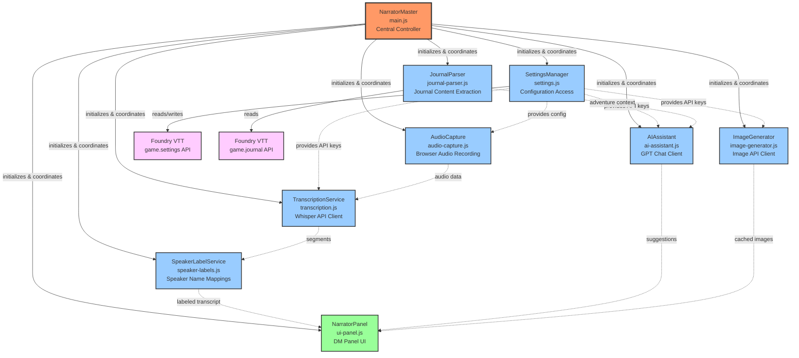

# CLAUDE.md - AI Assistant Context for Narrator Master

This document provides context for AI assistants working on the Narrator Master Foundry VTT module.

## Project Overview

**Narrator Master** is a Foundry VTT module that assists Dungeon Masters during tabletop RPG sessions by:
- Capturing and transcribing player audio with speaker diarization
- Analyzing conversations against the adventure journal
- Providing contextual suggestions and detecting when players go off-track
- Generating relevant images/infographics for story events

**Target**: Foundry VTT v13+
**Language**: Italian (primary), with localization support
**External API**: OpenAI (Whisper, GPT-4o-mini, gpt-image-1)

## TODO Tracking

**IMPORTANT**: A `TODO.md` file tracks all known issues, bugs, and improvements organized by priority (Critical → High → Medium → Low). Before starting any work session:

1. **Read `TODO.md`** to understand current known issues
2. **Check if your changes resolve any TODO item** — if so, move it to the "Completati" section with date and commit hash
3. **Check if your changes introduce new issues** — if so, add them to TODO.md with the appropriate priority
4. **After completing a feature or fix**, re-verify that no TODO items have been accidentally regressed

When running audits or code reviews, cross-reference findings against TODO.md to avoid duplicate entries.

## Architecture

Narrator Master follows a service-oriented architecture with a central controller orchestrating independent service classes. The following diagrams illustrate the system's design from two perspectives: **data flow** (how information moves through the system at runtime) and **component relationships** (how classes are organized and depend on each other).

### Data Flow Architecture

The following diagram shows the runtime data flow from audio capture through AI processing to UI updates:


**Key Data Flows:**

1. **Audio Pipeline**: Browser microphone → AudioCapture → TranscriptionService → OpenAI Whisper API → Speaker-labeled segments → NarratorPanel
2. **Context Pipeline**: Foundry Journal → JournalParser → AIAssistant → OpenAI Chat API → Contextual suggestions → NarratorPanel
3. **Analysis Pipeline**: Transcribed conversation + Journal context → AIAssistant → Off-track detection + Narrative bridges → NarratorPanel
4. **Image Pipeline**: User request → ImageGenerator → OpenAI Image API → Cached base64 images → NarratorPanel
5. **Configuration Flow**: SettingsManager provides API keys and settings to all services

**External API Calls:**
- TranscriptionService → `POST /v1/audio/transcriptions` (Whisper)
- AIAssistant → `POST /v1/chat/completions` (GPT-4o-mini)
- ImageGenerator → `POST /v1/images/generations` (gpt-image-1)

### Component Architecture

The following diagram shows the static relationships between service classes and the central NarratorMaster controller:



**Key Relationships:**

- **NarratorMaster** (red) - Central controller that initializes and coordinates all services during Foundry's 'ready' hook (GM-only)
- **Service Classes** (blue) - Independent, reusable components following consistent OOP patterns
- **Foundry APIs** (pink) - Native Foundry VTT systems that services interact with
- **NarratorPanel** (green) - UI layer that displays aggregated data from all services

**Dependency Patterns:**
- Solid arrows (→) indicate initialization/orchestration by NarratorMaster
- Dashed arrows (-.→) indicate runtime data flow or configuration dependencies
- SettingsManager acts as a configuration hub, providing API keys to OpenAI-dependent services
- Services are loosely coupled - they don't directly depend on each other, only on NarratorMaster's coordination

### File Structure

```
./
├── module.json                 # Foundry VTT manifest
├── TODO.md                     # Known issues tracker (read before every session)
├── scripts/
│   ├── main.js                # Entry point, NarratorMaster controller, Hooks
│   ├── settings.js            # Settings registration, SettingsManager class
│   ├── openai-service-base.js # OpenAIServiceBase class, retry/queue logic
│   ├── audio-capture.js       # AudioCapture class, MediaRecorder, Web Audio API
│   ├── transcription.js       # TranscriptionService class, OpenAI Whisper
│   ├── journal-parser.js      # JournalParser class, Foundry Journal API
│   ├── ai-assistant.js        # AIAssistant class, OpenAI GPT chat
│   ├── image-generator.js     # ImageGenerator class, OpenAI image generation
│   ├── speaker-labels.js      # SpeakerLabelService, persistent speaker mappings
│   └── ui-panel.js            # NarratorPanel Application class
├── styles/
│   └── narrator-master.css    # All styling, including off-track warnings (red)
├── templates/
│   └── panel.hbs              # Handlebars template for DM panel (3 tabs)
├── lang/
│   ├── it.json                # Italian localization (primary, most complete)
│   ├── en.json                # English localization
│   ├── de.json                # German localization
│   ├── es.json                # Spanish localization
│   ├── fr.json                # French localization
│   ├── ja.json                # Japanese localization
│   ├── pt.json                # Portuguese localization
│   └── template.json          # Template for translators
└── docs/                      # User documentation (wiki)
```

## Key Components

### NarratorMaster (main.js)
The central controller that orchestrates all components:
- Initializes all services on Foundry 'ready' hook (GM-only)
- Wires audio capture → transcription → AI analysis → UI updates
- Handles API key propagation to all services
- Stored globally as `window.narratorMaster` for debugging

### Service Classes
All services follow consistent OOP patterns:

| Class | Purpose | Key Methods |
|-------|---------|-------------|
| `OpenAIServiceBase` | Base class for OpenAI services | `_retryWithBackoff()`, `_enqueueRequest()`, `getQueueSize()`, `clearQueue()` |
| `SettingsManager` | Access module settings | `getApiKey()`, `validateConfiguration()`, `getApiRetryEnabled()` |
| `AudioCapture` | Record browser audio | `start()`, `stop()`, `pause()`, `resume()` |
| `TranscriptionService` | Whisper API integration (extends OpenAIServiceBase) | `transcribe(audioBlob)`, `setMultiLanguageMode()` |
| `JournalParser` | Extract journal content | `parseAllJournals()`, `getAllContentForAI()`, `clearAllCache()` |
| `AIAssistant` | Generate suggestions (extends OpenAIServiceBase) | `analyzeContext()`, `detectOffTrack()`, `generateNarrativeBridge()` |
| `ImageGenerator` | Create images (extends OpenAIServiceBase) | `generateInfographic()`, `saveToGallery()`, `loadGallery()` |
| `SpeakerLabelService` | Speaker name mappings | `applyLabelsToSegments()`, `setLabel()`, `importMappings()` |
| `NarratorPanel` | DM panel UI | `render()`, `updateContent()`, `addTranscriptSegments()` |

### Common Service Patterns

```javascript
// All API services follow this pattern:
class ServiceName {
    constructor(apiKey, options = {}) {
        this.apiKey = apiKey;
        this.baseUrl = 'https://api.openai.com/v1';
        // ... options
    }

    setApiKey(newApiKey) {
        this.apiKey = newApiKey;
    }

    isConfigured() {
        return this.apiKey && this.apiKey.trim().length > 0;
    }

    // All API calls use _handleApiError for consistent error handling
    _handleApiError(response, operation) {
        // Returns localized error message
    }

    _createNetworkError() {
        // Creates network error with isNetworkError flag
    }

    static notifyError(error) {
        // Static method for external error notification
    }
}
```

### Retry and Queue Architecture

All OpenAI API services inherit from `OpenAIServiceBase` (scripts/openai-service-base.js), which provides robust retry logic and request queuing to handle transient failures and rate limiting.

#### Exponential Backoff Retry

**Key Features**:
- Automatic retry for transient errors (network failures, rate limits, server errors 5xx)
- Exponential backoff: `delay = baseDelay * 2^attempt + jitter`
- Jitter (0-25% of delay) prevents thundering herd
- Respects `Retry-After` headers (both seconds and HTTP-date formats)
- Does NOT retry client errors (400-499 except 429)

**Configuration** (set in constructor `options`):
```javascript
{
    maxRetryAttempts: 3,        // Maximum retry attempts (default: 3)
    retryBaseDelay: 1000,       // Base delay in ms (default: 1000)
    retryMaxDelay: 60000,       // Max delay cap in ms (default: 60000)
    retryEnabled: true          // Enable/disable retry (default: true)
}
```

**Retryable Errors**:
- Network errors (connection failures, timeouts)
- HTTP 429 (Rate Limited)
- HTTP 500-599 (Server Errors)

**Non-Retryable Errors**:
- HTTP 400 (Bad Request)
- HTTP 401 (Invalid API Key)
- HTTP 413 (File Too Large)
- Other 4xx client errors

**Example Retry Timing**:
```
Attempt 1: 0ms (immediate)
Attempt 2: ~1250ms (1000 * 2^0 + jitter)
Attempt 3: ~2500ms (1000 * 2^1 + jitter)
Attempt 4: ~5000ms (1000 * 2^2 + jitter)
```

#### Request Queue

**Key Features**:
- Sequential processing (one request at a time) to avoid rate limiting
- Priority support (higher priority requests processed first)
- FIFO for equal-priority requests
- Queue size limit prevents memory exhaustion
- Each queued request automatically uses retry logic

**Configuration**:
```javascript
{
    maxQueueSize: 100  // Maximum queued requests (default: 100)
}
```

**Queue Methods**:
- `_enqueueRequest(operation, context, priority)` - Add request to queue
- `_processQueue()` - Process queue sequentially
- `getQueueSize()` - Get current queue length
- `clearQueue()` - Cancel all pending requests

**Priority Levels**:
- `priority > 0` - High priority (processed first)
- `priority = 0` - Normal priority (FIFO)
- Higher numbers = higher priority

#### Settings Integration

Retry and queue behavior can be configured via Foundry settings (GM-only):

| Setting | Default | Purpose |
|---------|---------|---------|
| `apiRetryEnabled` | `true` | Enable/disable automatic retry |
| `apiRetryMaxAttempts` | `3` | Maximum retry attempts |
| `apiRetryBaseDelay` | `1000` | Base delay in ms (before exponential backoff) |
| `apiRetryMaxDelay` | `30000` | Maximum delay in ms between retries |
| `apiQueueMaxSize` | `10` | Maximum number of requests that can be queued |

**Accessing settings**:
```javascript
const retryEnabled = settingsManager.getApiRetryEnabled();
const maxAttempts = settingsManager.getApiRetryMaxAttempts();
const baseDelay = settingsManager.getApiRetryBaseDelay();
const maxDelay = settingsManager.getApiRetryMaxDelay();
const queueSize = settingsManager.getApiQueueMaxSize();
```

#### Usage Example

```javascript
import { OpenAIServiceBase } from './openai-service-base.js';

class MyAPIService extends OpenAIServiceBase {
    constructor(apiKey, options = {}) {
        super(apiKey, {
            maxRetryAttempts: 3,
            retryBaseDelay: 1000,
            retryMaxDelay: 60000,
            retryEnabled: true,
            maxQueueSize: 100,
            ...options
        });
    }

    async callAPI() {
        // Wrap API call with retry logic
        return await this._retryWithBackoff(
            async () => {
                const response = await fetch(this._baseUrl + '/endpoint', {
                    method: 'POST',
                    headers: {
                        'Authorization': `Bearer ${this._apiKey}`,
                        'Content-Type': 'application/json'
                    },
                    body: JSON.stringify({ /* ... */ })
                });

                if (!response.ok) {
                    throw await this._handleApiError({
                        status: response.status,
                        message: await response.text()
                    }, 'Operation Name');
                }

                return await response.json();
            },
            { operationName: 'MyAPIService.callAPI' }
        );
    }

    async queuedAPICall() {
        // Use queue for concurrent request management
        return await this._enqueueRequest(
            () => this.callAPI(),
            { operationName: 'MyAPIService.queuedAPICall' },
            0  // Normal priority
        );
    }
}
```

## Foundry VTT Patterns

### Hook Registration (main.js)
```javascript
// Settings and templates during 'init'
Hooks.once('init', async function() {
    registerSettings();
    await loadTemplates([`modules/${MODULE_ID}/templates/panel.hbs`]);
});

// Instance creation during 'ready' (GM-only)
Hooks.once('ready', async function() {
    if (game.user.isGM) {
        window.narratorMaster = new NarratorMaster();
        await window.narratorMaster.initialize();
    }
});

// Sidebar controls via getSceneControlButtons
Hooks.on('getSceneControlButtons', (controls) => {
    // Add narrator-master control group
});
```

### Settings API (settings.js)
```javascript
// Register settings with game.settings.register()
game.settings.register(MODULE_ID, 'settingKey', {
    name: 'LOCALIZATION.Key',      // i18n key
    hint: 'LOCALIZATION.HintKey',
    scope: 'world',                 // 'world' = GM-only, 'client' = per-user
    config: true,                   // Show in settings UI
    type: String,                   // String, Boolean, Number, Object
    default: '',
    onChange: value => { /* callback */ }
});

// Access settings via game.settings.get/set()
const value = game.settings.get(MODULE_ID, 'settingKey');
await game.settings.set(MODULE_ID, 'settingKey', newValue);
```

### Application Class (ui-panel.js)
```javascript
class NarratorPanel extends Application {
    static get defaultOptions() {
        return mergeObject(super.defaultOptions, {
            id: 'narrator-master-panel',
            title: game.i18n.localize('NARRATOR.PanelTitle'),
            template: 'modules/narrator-master/templates/panel.hbs',
            classes: ['narrator-master'],
            width: 400,
            height: 600,
            resizable: true
        });
    }

    getData() {
        return { /* template context */ };
    }

    activateListeners(html) {
        super.activateListeners(html);
        html.find('.button').click(this._onClick.bind(this));
    }
}
```

### Journal Access (journal-parser.js)
```javascript
// Get journal by ID
const journal = game.journal.get(journalId);

// Iterate pages (v10+ API)
for (const page of journal.pages) {
    if (page.type === 'text') {
        const content = page.text.content; // HTML content
    }
}
```

## Localization

All user-facing strings use Foundry's i18n system:

```javascript
// In JavaScript
game.i18n.localize('NARRATOR.Panel.Title');

// In Handlebars
{{localize 'NARRATOR.Panel.Title'}}
```

Keys are organized in `lang/*.json` (primary: `it.json`, reference: `en.json`):
- `NARRATOR.Settings.*` - Settings labels and hints
- `NARRATOR.Panel.*` - Panel UI elements
- `NARRATOR.Errors.*` - Error messages
- `NARRATOR.Notifications.*` - Toast notifications
- `NARRATOR.OffTrack.*` - Off-track detection messages
- `NARRATOR.SpeakerLabels.*` - Speaker label UI strings
- `NARRATOR.Suggestions.*` - Suggestion type/confidence labels
- `NARRATOR.Recording.*` - Recording state labels
- `NARRATOR.Images.*` - Image gallery strings

**IMPORTANT**: When adding/modifying i18n keys, update ALL language files (`it.json`, `en.json`, and ideally `de.json`, `es.json`, `fr.json`, `ja.json`, `pt.json`). Run `node verify-translations.js` to check for missing keys across languages.

## External APIs

### OpenAI API
- **Base URL**: `https://api.openai.com/v1`
- **Auth**: Bearer token (user-provided API key)
- **Minimum requirement**: Paid API account ($5 credit minimum)

**Endpoints used**:
| Endpoint | Model | Purpose |
|----------|-------|---------|
| `/audio/transcriptions` | `gpt-4o-transcribe-diarize` | Audio transcription with speaker labels |
| `/chat/completions` | `gpt-4o-mini` | Suggestions and analysis |
| `/images/generations` | `gpt-image-1` | Infographics and illustrations |

**Important notes**:
- Image URLs expire after 60 minutes - download/cache immediately
- Audio files max 25MB - use chunking for longer recordings
- Use `gpt-image-1` not `dall-e-3` (deprecated May 2026)

## Build & Release

### Build the package

```bash
bash build.sh      # Linux/macOS
build.bat           # Windows
```

The build script auto-detects module ID, version, and GitHub URL from `module.json`. It creates a clean ZIP in `releases/{id}-v{version}.zip` with the download URL already set in the packaged module.json.

### Publish a new release

1. **Update `module.json`** - change these two fields:
   - `"version"`: bump to the new version (e.g. `"X.Y.Z"`)
   - `"download"`: update to match: `https://github.com/Aiacos/narrator_master/releases/download/vX.Y.Z/narrator-master-vX.Y.Z.zip`

2. **Build the package**:
   ```bash
   bash build.sh
   ```

3. **Commit and push**:
   ```bash
   git add module.json
   git commit -m "Bump version to X.Y.Z"
   git push
   ```

4. **Create GitHub release** (uploads both module.json manifest AND ZIP):
   ```bash
   gh release create vX.Y.Z releases/narrator-master-vX.Y.Z.zip module.json --title "vX.Y.Z - Description" --latest
   ```

> **Why `module.json` is uploaded separately**: Foundry VTT downloads the standalone `module.json` first (via the manifest URL) to discover the module version and its download URL. The ZIP also contains a `module.json` but that's only used after installation.

### Foundry VTT Manifest URL

```
https://github.com/Aiacos/narrator_master/releases/latest/download/module.json
```

## Common Tasks

### Adding a New Setting
1. Add key to `SETTINGS` constant in `settings.js`
2. Register in `registerSettings()` function
3. Add getter method to `SettingsManager` class
4. Add localization strings to ALL `lang/*.json` files (at minimum `it.json` and `en.json`)
5. Update `TODO.md` if the change resolves a known issue

### Adding a New Service
1. Create `scripts/new-service.js` following existing patterns
2. Import in `main.js`
3. Instantiate in `NarratorMaster._initializeServices()`
4. Wire up handlers as needed

### Modifying the UI Panel
1. Update template in `templates/panel.hbs`
2. Add data to `getData()` in `ui-panel.js`
3. Add event handlers in `activateListeners()`
4. Add styling in `styles/narrator-master.css`
5. Add localization keys to ALL `lang/*.json` files (at minimum `it.json` and `en.json`)

### Adding Error Handling
Use the centralized `ErrorNotificationHelper` class:
```javascript
ErrorNotificationHelper.error(error, 'Context');
ErrorNotificationHelper.warn(message, 'Context');
ErrorNotificationHelper.handleApiError(error, 'Operation Name');
```

## Gotchas & Pitfalls

### Audio Capture
- **HTTPS required** for microphone access in production (localhost works for dev)
- Browser permission is one-time but may need re-granting
- MediaRecorder requires specific MIME types (`audio/webm;codecs=opus`)
- Always call `destroy()` to release media streams

### Foundry VTT
- `game.user.isGM` check required for DM-only features
- `game.journal` not available during 'init' hook - use 'ready'
- Settings with `scope: 'world'` are GM-only
- Never use deprecated `journal.content` - use `journal.pages`

### OpenAI API
- **Retry logic is automatic** - All OpenAI services inherit from `OpenAIServiceBase` with built-in exponential backoff
- Rate limiting (HTTP 429) is automatically retried - honors `Retry-After` headers
- Network errors and server errors (5xx) are retried - client errors (4xx except 429) are NOT retried
- Queue processes requests sequentially - prevents rate limiting from concurrent requests
- Transcription requires `FormData` with proper file naming
- Images return URLs that expire - always download to base64
- gpt-4o-transcribe-diarize requires `response_format: 'diarized_json'`
- **Queue can fill up** - If queue is full (`maxQueueSize`), requests will throw an error immediately

### Localization
- All strings MUST use i18n keys - no hardcoded text
- Test with Italian locale to catch missing translations
- Handlebars uses `{{localize 'KEY'}}` not `{{i18n 'KEY'}}`

## Testing

### Syntax Check
```bash
find scripts -name '*.js' -exec node --check {} \;
```

### JSON Validation
```bash
python3 -c 'import json; json.load(open("module.json")); json.load(open("lang/it.json")); json.load(open("lang/en.json")); print("OK")'
```

### Translation Key Verification
```bash
node verify-translations.js
```
Checks that all language files have the same keys as `it.json` (the primary/most complete translation).

### Manual Testing in Foundry
1. Symlink module: `ln -s $(pwd)/narrator-master ~/.local/share/FoundryVTT/Data/modules/`
2. Enable in Game Settings > Manage Modules
3. Check browser console for errors
4. Verify panel opens, recording works, AI features function

## Code Style

- **ES6 Modules**: Use `import`/`export`
- **JSDoc**: Document all classes and public methods
- **Private methods**: Prefix with `_` (e.g., `_handleApiError`)
- **Constants**: UPPER_SNAKE_CASE
- **Classes**: PascalCase
- **Functions/methods**: camelCase

### Logging Guidelines

**IMPORTANT**: Use the centralized `Logger` utility instead of direct `console.*` calls:

```javascript
import { Logger } from './logger.js';

// Debug messages (only shown when debug mode is enabled)
Logger.debug('Detailed diagnostic info', 'AudioCapture', audioData);
Logger.debug('Processing segment', 'TranscriptionService');

// Info messages (important runtime information)
Logger.info('Recording started', 'AudioCapture');
Logger.info('Module initialized', 'NarratorMaster');

// Warning messages (potentially problematic situations)
Logger.warn('API rate limit approaching', 'TranscriptionService');
Logger.warn('Using fallback configuration', 'SettingsManager');

// Error messages (failures requiring attention)
Logger.error(new Error('Connection failed'), 'AIAssistant');
Logger.error('Invalid API key format', 'TranscriptionService');
```

**When to use each log level**:
- `Logger.debug()` - Detailed diagnostic information, internal state, variable values (only shown in debug mode)
- `Logger.info()` - Important runtime events, initialization, completion notifications (always visible)
- `Logger.warn()` - Deprecated usage, rate limiting, fallback behavior, recoverable errors (always visible)
- `Logger.error()` - Exceptions, failures requiring attention, unrecoverable errors (always visible)

**Debug mode**:
```javascript
// Enable debug mode for detailed diagnostic output
Logger.enableDebugMode();

// Check debug state
if (Logger.isDebugMode()) {
    // Conditionally execute debug-only logic
}

// Disable debug mode
Logger.disableDebugMode();
```

**Best practices**:
- Always provide a context parameter (class name, operation name) for easier log filtering
- Use the optional `data` parameter for complex objects/arrays
- Never use direct `console.log()` - ESLint will flag it
- Debug messages are automatically suppressed in production unless explicitly enabled
- Logger uses `console.warn` for debug/info/warn and `console.error` for errors to comply with ESLint rules

## File Modification Guidelines

When modifying files:
1. **Read `TODO.md` first** to understand known issues and avoid regressions
2. Maintain existing code style and patterns
3. Update JSDoc comments for any changed functionality
4. Add/update localization strings in ALL `lang/*.json` files (minimum `it.json` + `en.json`)
5. Test both with and without API key configured
6. Verify GM-only features don't appear for players
7. **Update `TODO.md`** if your changes resolve or introduce issues

## Dependencies

**Runtime**: None (pure ES6 modules)
**Development**: Optional Jest for testing
**External**: OpenAI API (paid account required)
